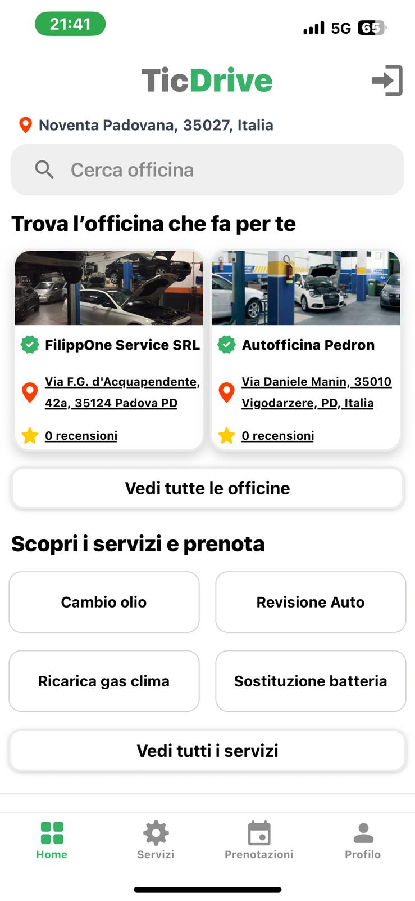
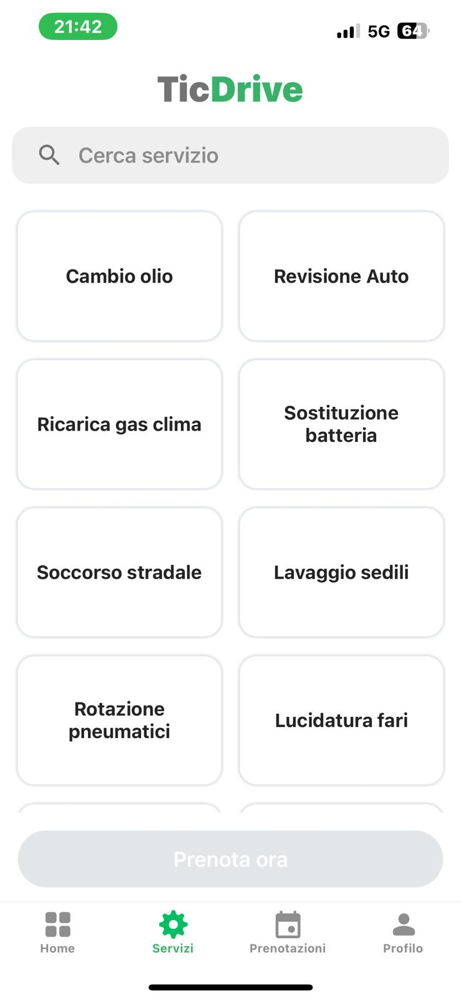

# 🚗 TicDrive - Car Service Booking App

TicDrive is a **React Native mobile application** (iOS & Android) developed for a startup that aimed to simplify how users book car services directly from their homes.  
The app connects users with local auto repair shops, allowing them to **browse services, book appointments and manage reservations** from their phone.

---

## 📱 Features

- 🔍 **Search workshops** by location and availability  
- 🗺️ **Interactive map** to find nearby workshops  
- 🛠️ **Browse car services** (oil change, battery replacement, tire rotation, AC recharge, etc.)  
- 📅 **Book appointments online** with local workshops  
- ⭐ **Review & rating system** for workshops  
- 📷 **Image upload and management** via Azure Blob Storage  
- 🌐 **Multi-platform support** (iOS & Android)  

---

## 🛠️ Tech Stack

### Frontend (Mobile App)
- [React Native](https://reactnative.dev/) – cross-platform mobile development  
- [Expo](https://expo.dev/) – build & deploy tools  
- [React Navigation](https://reactnavigation.org/) – routing and navigation  
- Redux / Context API – state management  
- Maps Integration – interactive geolocation features  

### Backend
- [.NET Core 8](https://learn.microsoft.com/en-us/aspnet/core/?view=aspnetcore-8.0) – RESTful API  
- [Azure Blob Storage](https://azure.microsoft.com/en-us/services/storage/blobs/) – image storage and management  

---

## 👨‍💻 Development

This project was mainly developed by myself (**Andrei Albu**) with final contributions and support from **Hilina Mengesha**.  

It was built as part of a startup project idea to help users **save time, compare reviews and prices and book car services from the comfort of their home**:

---

## 📸 Screenshots
## 📸 Screenshots

<table>
  <tr>
    <td></td>
    <td></td>
    <td></td>
  </tr>
  <tr>
    <td></td>
    <td></td>
    <td></td>
  </tr>
  <tr>
    <td></td>
    <td></td>
  </tr>
</table>
